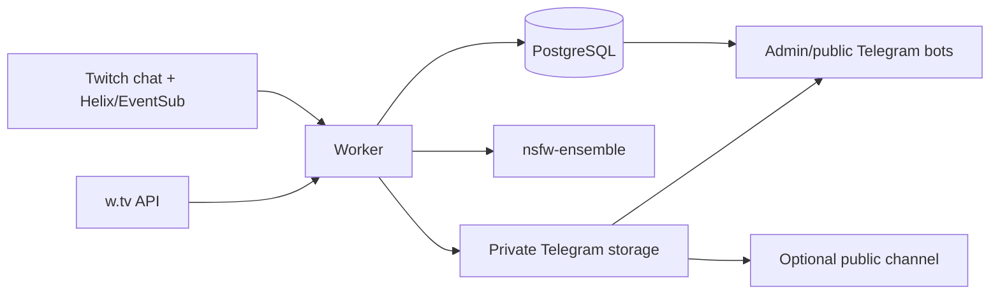

# Архитектура

`worker` — единственный ingestion-процесс: определяет live status, принимает чат, создаёт задания, скачивает/нормализует медиа, получает NSFW score, публикует в Telegram. `bot` читает PostgreSQL и копирует сохранённые Telegram messages.

## Workspace

| Путь | Назначение |
| --- | --- |
| `apps/worker` | Twitch/w.tv ingestion, download queue, Telegram, VOD recovery |
| `apps/bot` | Закрытый admin-бот и опциональный public browser |
| `apps/nsfw-ensemble` | Owen + SigLIP HTTP classifier, порт 3333 |
| `packages/core` | URL/media helpers, SSRF-защита |
| `packages/media-processing` | ImageMagick/ffmpeg для Telegram |
| `packages/nsfw` | Извлечение кадров, classifier client |
| `prisma` | Schema и production migrations |

pnpm workspace и Turborepo управляют `build`, `test`, `typecheck`, `lint` по dependency graph.

## Runtime

Worker каждые 5 секунд:

1. поддерживает Twitch EventSub WebSocket и IRC/TMI chat;
2. обрабатывает до `MAX_PARALLEL_DOWNLOADS` jobs;
3. опрашивает Twitch/w.tv live status;
4. чистит истёкший Twitch message buffer.

Ошибки poll-задач изолированы. SIGINT/SIGTERM останавливают loop, дожидаются download task, закрывают Prisma.

## Данные

| Модель | Роль |
| --- | --- |
| `Streamer` | Канал и последний status |
| `StreamSession` | Логический стрим с 30-минутным grace period |
| `TwitchChatMessage` | Временный текст для delete events |
| `DeletedChatMessage` | Постоянный журнал удалённых сообщений |
| `ChatPost` | Один media URL в message/session |
| `Asset` | Дедуплицированное медиа и Telegram IDs |
| `DownloadJob` | Очередь, попытки, `nextRetryAt` |
| `BlockedMedia` | Blocklist URL/SHA-256 |
| `AdminAuditLog` | Исторический аудит, текущий бот не пишет |

`Streamer` содержит sessions; session — posts; несколько posts могут ссылаться на asset. Job создаётся только без активного job для asset.

## Границы v1

- HTTP API, web UI, S3/MinIO runtime отсутствуют.
- Новые assets всегда используют Telegram.
- `storageProvider`, `s3Key`, `publicUrl` остаются только для старых данных.
- Единственный NSFW runtime — `apps/nsfw-ensemble`.
